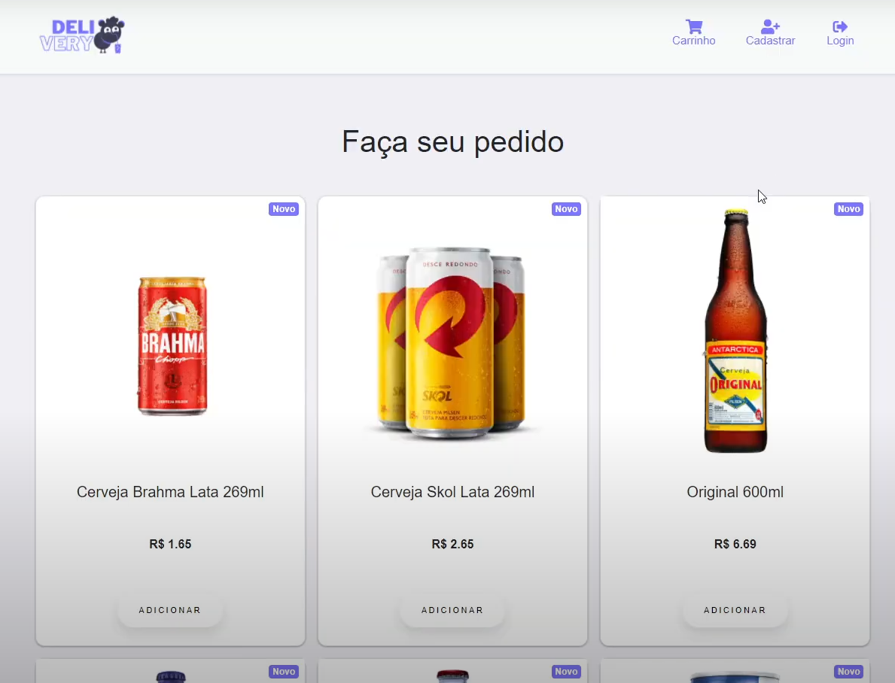
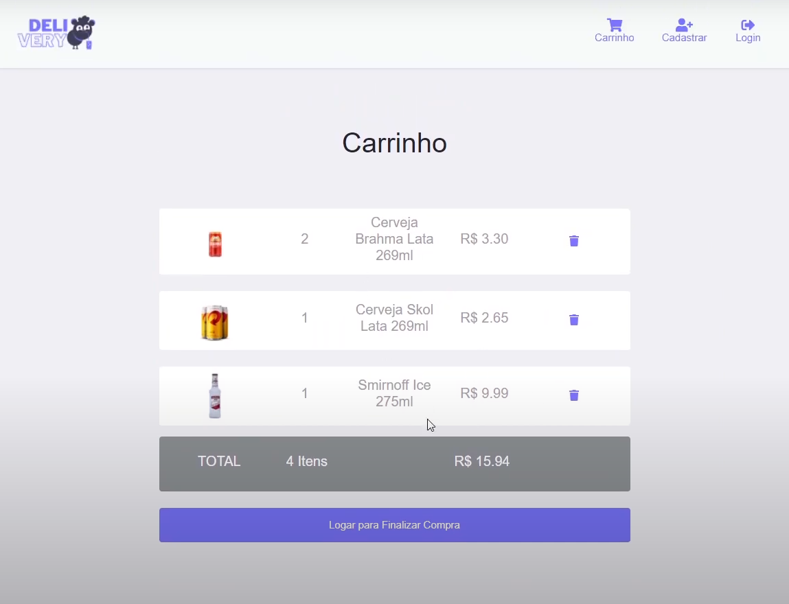
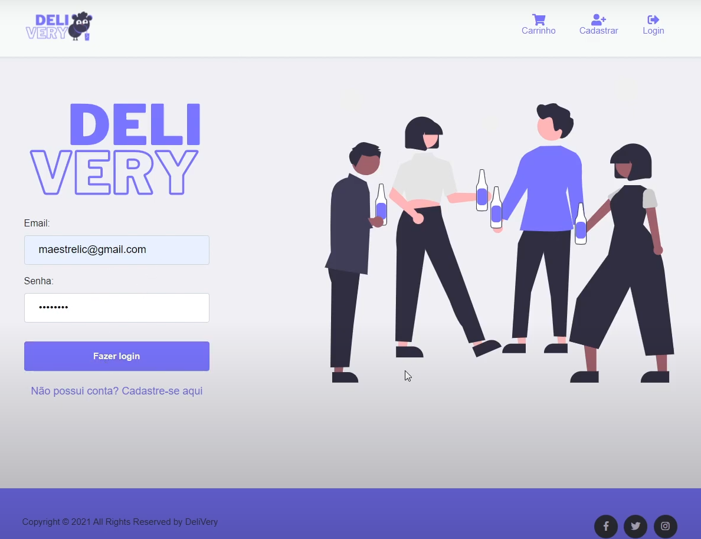
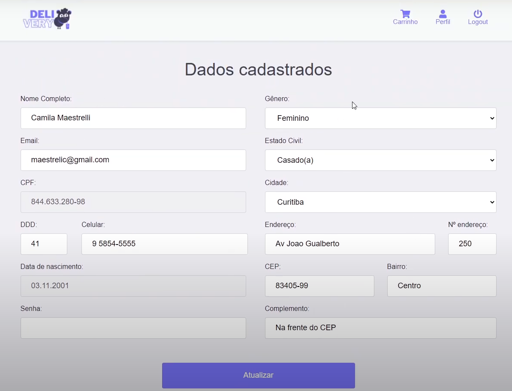
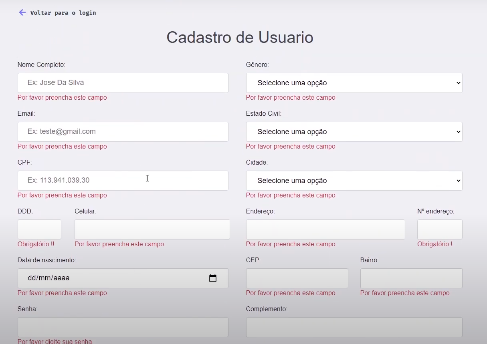
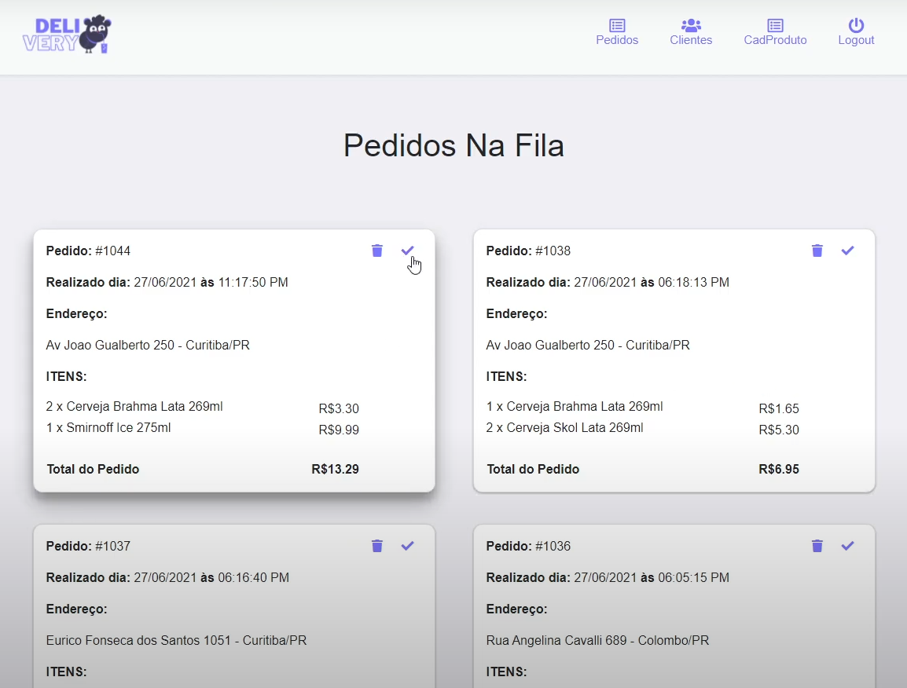
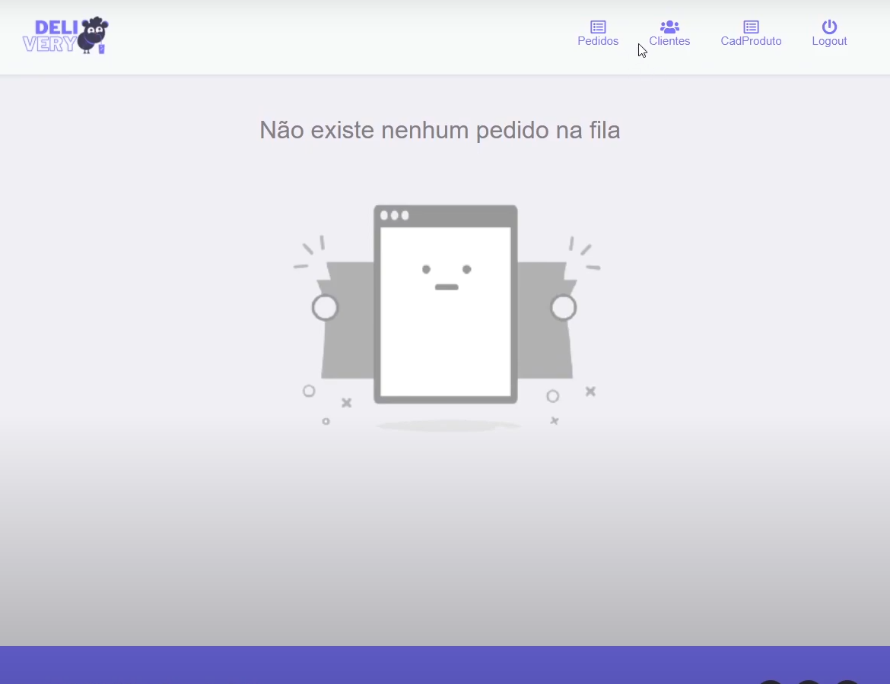
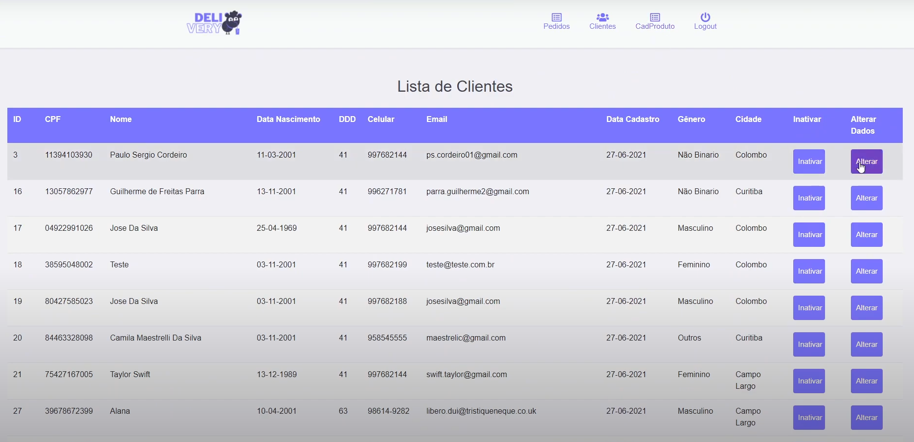
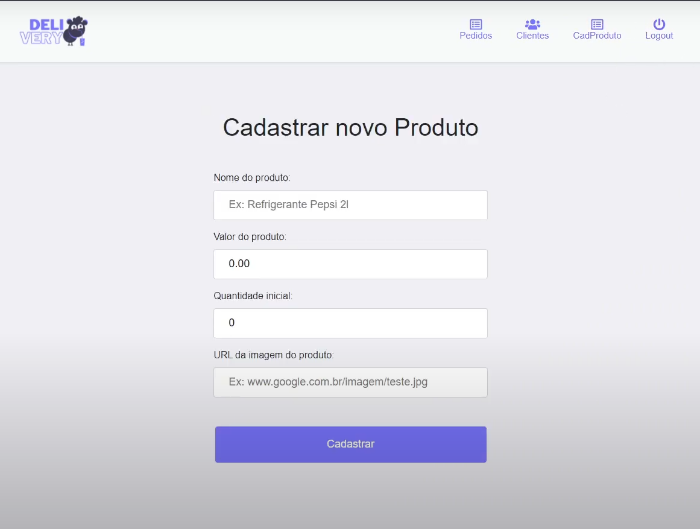

<h1 align="center">
  
</h1>

<h4 align="center">
  <b align="center">Developed with the aim of creating a functional beverage store, thinking both on the client side and on the administrator side, using java, MVC architecture, JSF and connection to SQL Server database </b>
</h4>

 

## :man_technologist: Built with

This project was developed with the following technologies:

-  [Java](https://www.oracle.com/br/java/technologies/javase-downloads.html)
-  [JSF](https://www.oracle.com/java/technologies/javaserverfaces.html)
-  [Bootstrap](https://getbootstrap.com/)
-  [SQL Server](https://www.microsoft.com/pt-br/sql-server/sql-server-2019)
-  [Eclipse](https://www.eclipse.org/downloads/)

## :computer: Preview

## :page_facing_up: License

This project is under the MIT license. 

## :mailbox_with_mail: Get in touch!

[LinkedIn](https://www.linkedin.com/in/pscordeiro/)
